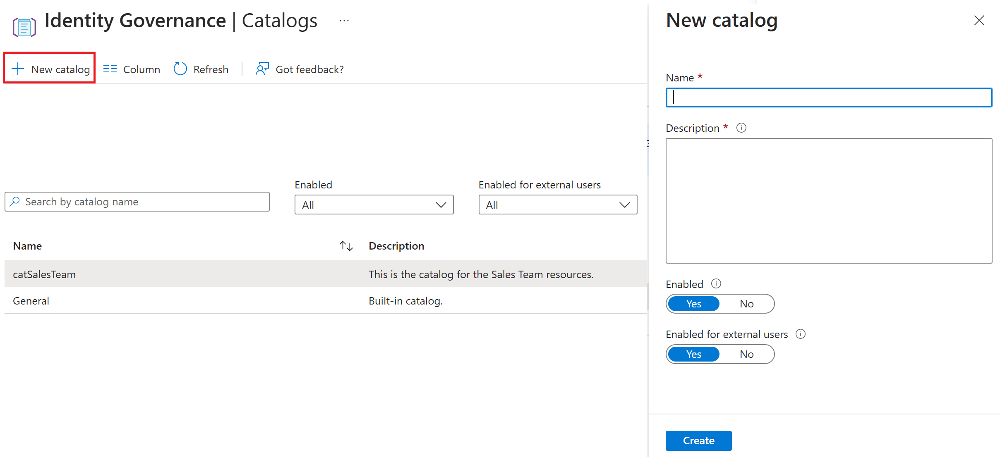

---
lab:
  title: 'Laboratorio 1: Creación de un catálogo para su uso en Derechos'
  module: 'Module : Deploying access using Microsoft Entra entitlement management'
---

# Laboratorio 1: Creación de un catálogo en la administración de derechos de Microsoft Entra

## Escenario del laboratorio

En una compañía mediana de desarrollo de software, el departamento de TI decide implementar Microsoft Entra para la administración de derechos. El objetivo principal es simplificar el acceso a los recursos y las aplicaciones de toda la organización. Con Microsoft Entra, pueden definir paquetes de acceso basados en roles o proyectos, lo que simplifica el proceso de concesión o revocación de derechos de acceso. Por ejemplo, cuando un nuevo desarrollador se une a un proyecto, el departamento de TI puede proporcionarle fácilmente el acceso necesario asignandolo al paquete de acceso correspondiente. Esto no solo ahorra tiempo, sino que también reduce el riesgo de acceso no autorizado. Además, las revisiones periódicas de acceso de Microsoft Entra garantizan que solo las personas adecuadas tengan acceso a recursos confidenciales. En el laboratorio de implementación, el equipo de TI configurará varios paquetes de acceso, definirá directivas para la asignación y revocación automáticas de acceso, y realizará una revisión de acceso simulada.

## Objetivos

Después de completar este laboratorio, podrá:

- Crear un catálogo.
- Configurar un paquete de acceso.
- Implementar un paquete de acceso en un usuario.
- Aceptar el derecho como usuario y confirmar el acceso a los recursos.
- Revocar el acceso a un paquete.

## Configuración del laboratorio
  - **Tiempo estimado: 30 minutos**

### Ejercicio 1: Creación de un catálogo para el equipo de Ventas

#### Tarea 1: Creación de un catálogo

1. Inicia el Centro de administración Microsoft Entra en `https://Entra.Microsoft.com`.

1. En el menú de la izquierda, ve a **Gobernanza de identidades** y, a continuación **, Administración de derechos**.

1. Selecciona **Catálogos** en el menú.

 

1. En la parte superior de la pantalla, selecciona **+ Nuevo catálogo**.

1. Asigna un nombre y describe el **Nuevo catálogo** con los siguientes valores:

  | Campo | Valor |
  | :---  | :---  |
  | Nombre  | `catSales` |
  | Descripción | `Use this catalog to assign resources for memebers of the Sales team.` |
  | habilitado | Sí |
  | Habilitado para los usuarios externos | No |
  | | |

1. Seleccione **Crear**.

#### Tarea 2: Adición de recursos al catálogo

1. Si aún no estás allí, ve al **Centro de administración Microsoft Entra**, **Gobernanza de identidades**, **Administración de derechos** y, a continuación, la página **Catálogos**.

1. Selecciona las **catSales** que creamos en la tarea anterior.

1. Selecciona **Recursos** en el menú.

1. Luego, en la parte superior de la página, selecciona **+ Agregar recursos**.

 

1. Con los selectores de la parte superior de la pantalla, agrega los siguientes recursos:

  | Tipo de recurso | Valor |
  | :---  | :---  |
  | + Grupos y equipos  | Ventas y marketing, y Ventas de EE. UU. |
  | + Aplicaciones | LinkedIn |
  | + Sitios de SharePoint | Ventas y marketing, y Ventas de EE. UU. |
  | | |

1. Selecciona el botón **Agregar**.

#### Tarea 3: Creación de un nuevo usuario para recibir el derecho

1. Si aún no estás allí, ve al **Centro de administración Microsoft Entra**.

1. En el menú de la izquierda, selecciona **Identidad**, **Usuario** y **Todos los usuarios** en los menús.

1. Selecciona **+ Nuevo usuario** en la parte superior de la página.

1. Rellena los valores de la página **Datos básicos**:

  | Campo | Value |
  | :---  | :---  |
  | Nombre principal de usuario  | `ChrisGr` |
  | Nombre para mostrar | `Christopher Green` |
  | Contraseña generada automáticamente | Registrado |
  | Cuenta habilitada | Registrado |
  | | |

1. Copia y pega la "Contraseña" en una ubicación segura como el Bloc de notas (necesitarás la contraseña más adelante en este laboratorio).

1. Selecciona la pestaña "Propiedades".

1. En la parte inferior de la pantalla Propiedades, establece la **Ubicación de utilización = Estados Unidos**.

1. Selecciona **Revisar + crear** y, luego, **Crear**.

#### Tarea 4: Generación del paquete de acceso

1. En el Centro de administración Microsoft Entra, selecciona **Gobernanza de identidades** y, a continuación, selecciona **Administración de derechos**.

1. En el menú Administración de derechos, selecciona **Paquetes de acceso**.

1. Selecciona **+ Nuevo paquete de acceso** en la parte superior de la pantalla.

1. Escribe los valores solicitados:

  | Campo | Valor |
  | :---  | :---  |
  | Nombre  | `pckSales` |
  | Nombre para mostrar | `Use this access package to assign resources to members of the Sales team.` |
  | Catálogo | catSales |
  | | |

  **Nota**: Debes elegir el catálogo catSales que creamos en la tarea anterior. Esto proporcionará la lista de recursos disponibles para asignarse en este paquete.  Hay un paquete General que aparece como predeterminado.  Si lo elegiste accidentalmente, no verás ningún recurso disponible.

1. Selecciona la pestaña "Roles de recursos".

1. Selecciona los recursos que deseas proporcionar en tu paquete de acceso, en los elementos del catálogo catSales. A continuación, usa la el elemento desplegable **Seleccionar rol** para establecer el rol que aparece en la tabla siguiente.

  | Tipo de recurso | Valor | Role |
  | :---  | :---  | :--- |
  | + Grupos y equipos  | Ventas y marketing | Member |
  | + Aplicaciones | LinkedIn | msiam_access |
  | + Sitios de SharePoint | Ventas de EE. UU. | Miembros de ventas de EE. UU. |
  | | |

1. Con el elemento desplegable **Seleccionar rol**, establece el **Miembro** de cada rol para cada elemento.

1. Selecciona **Siguiente: Solicitudes>** para ir a la pestaña Solicitudes.

1. En **Usuarios que pueden solicitar acceso**, selecciona la opción **Ninguno (solo para las asignaciones directas del administrador).

1. Establece **Habilitar** en **Sí**.

1. Ve a la pestaña **Ciclo de vida** con las etiquetas de la parte superior de la pantalla.

1. Elige los valores para establecer el ciclo de vida del paquete:

  | Campo | Value |
  | :---  | :---  |
  | Caducidad de las asignaciones de paquetes de acceso  | Número de días |
  | Las asignaciones caducan después de | 30 |
  | Los usuarios pueden solicitar una escala de tiempo específica | No |
  | Exigir revisiones de acceso | No |
  | | |

1. En la parte inferior de la pantalla, selecciona **Revisar + crear**.

1. Revisa los valores que elegiste en la pantalla Revisar + crear.

1. Selecciona **Crear** para compilar el paquete de acceso.

#### Tarea 5: Asignación del paquete a Christopher

1. Asegúrate de que estás en **Centro de administración Microsoft Entra**, **Gobernanza de identidades**, **Administración de derechos** y de que el menú **Paquetes de acceso** está abierto.

1. Selecciona las **pckSales** que creamos en la tarea anterior.

1. En el menú, selecciona **Asignaciones**.

1. Selecciona **+ Nueva asignación** en la parte superior de la pantalla.

1. En **Seleccionar directiva**, usa la **Directiva inicial** proporcionada en el elemento desplegable.

1. Asegúrate de que la opción **El usuario ya está en mi directorio** está marcada.

1. Selecciona el elemento **Agregar usuarios** en el cuadro de diálogo.

1. Busca **Christopher Green** en la lista de usuarios.  Coloca una marca de verificación en el cuadro junto al nombre.  Haz clic en el botón **Seleccionar** situado en la parte inferior de la pantalla.

1. Para los demás valores, mantén los valores predeterminados.

1. Seleccione el botón **Agregar** en la parte inferior de la página.

#### Tarea 6: Comprobación de si se ha agregado a Christopher Green

1. Abre una **Nueva ventana de InPrivate** en el explorador.

1. Conéctate al **Centro de administración Microsoft Entra** en la dirección `https://entra.microsoft.com`.

1. Inicia sesión en el sitio con la cuenta y la contraseña de Chistopher Green creadas anteriormente.

1. Se te solicitará un cambio de contraseña.  Establece una nueva contraseña y regístrala en una herramienta como Bloc de notas para su uso futuro.

1. Selecciona **Identidad**, **Usuarios**, **Todos los usuarios** y **Christopher Green**.

1. En el menú de la izquierda, selecciona **Grupos**.

1. Confirma que se te ha concedido acceso al grupo **Ventas y Marketing**, según el paquete de acceso.

1. En el menú de la izquierda, selecciona **Aplicaciones**.

1. Confirma que tienes **LinkedIn** en las aplicaciones asignadas.

#### Tarea 7: Desafío - Cambios dinámicos en el paquete de acceso

  **Nota:** Esta tarea no tiene instrucciones paso a paso. Se te proporciona el conjunto de tareas y puedes consultar los pasos anteriores para recordar dónde realizar cambios específicos.

- Asegúrate de haber iniciado sesión en el **Centro de administración Microsoft Entra** con la cuenta de administrador.
- Abre el paquete de acceso **pckSales**.
- Ve a los **Roles de recursos** y elige quitar el grupo **Ventas y marketing** y agrega en su lugar el grupo **Ventas de EE. UU.**
- Usa la pestaña **Asignaciones** para **volver a procesar** la asignación.
- Cierra sesión y vuelve a iniciarla como Christopher Green.  Fíjate en que las asignaciones de grupo han cambiado.  Tan rápido y fácil.
- Revoca el acceso eliminando la asignación de Christopher Green.

### Conclusión
Se trata de un laboratorio sencillo para demostrar las características básicas de la administración de derechos.  Piensa en la opción para la que podrías usar esta característica y las opciones de configuración avanzada que podrías configurar en el laboratorio.
